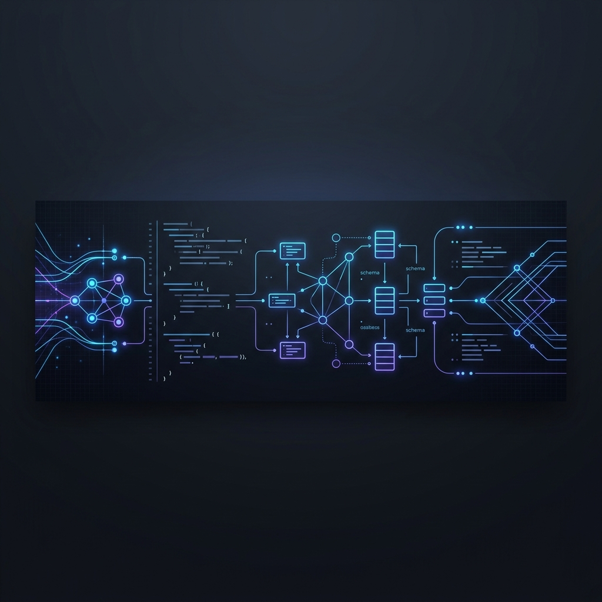

<h1 align="center">Hi there, I'm Akarsh Yadav! 👋</h1>

  

  <strong>Passionate developer focused on building high-performance, real-time web applications, robust backend architectures, and clean interactive user experiences.</strong>

  
  

---

### 💫 About Me

- 💻 I specialize in **Java (Spring Boot)**, **JavaScript**, and **Python**.
- 🚀 I love working on real-time systems, API development, and responsive frontends.
- ⚡ Fun fact: I recently built **[Appi](https://github.com/AkarshYadav9411/Appi)**, a multi-session real-time chat room powered by Spring WebSockets (STOMP) and SockJS!
- 🔭 I’m currently looking to expand my knowledge in cloud architecture and microservices.
- 📫 How to reach me: Drop me an email at [akarshyadav421@gmail.com](mailto:akarshyadav421@gmail.com).

---

### 🛠️ Tech Stack & Toolbox

| Category | Technologies |
| :--- | :--- |
| **Languages** |  &nbsp;  &nbsp;  &nbsp;  &nbsp;  |
| **Backend Frameworks** |  &nbsp;  |
| **Frontend Utilities** |  &nbsp;  |
| **DevOps & Tools** |  &nbsp;  &nbsp;  &nbsp;  |
| **AI & Concepts** |  |

---

### 📂 Featured Projects

Here are some of my personal projects that showcase my development journey:

#### 💬 [Appi - Real-Time Chat App](https://github.com/AkarshYadav9411/Appi)
*A lightweight, responsive, and real-time chat application enabling instant bi-directional messaging.*
- **Tech Stack:** Java 21, Spring Boot, STOMP WebSockets, SockJS, Thymeleaf, Bootstrap 5.
- **Key Feature:** Leverages message brokers for low-latency client-server notifications and multi-tab state sync.

#### 📊 [Aura Productivity Dashboard](https://github.com/AkarshYadav9411/Aura-productivity-Dashboard)
*An interactive and sleek dashboard application designed to help users organize their daily tasks and track focus metrics.*
- **Tech Stack:** JavaScript, HTML5, CSS3.
- **Key Feature:** Modern grid layout, user state persistence, and responsive widgets.

#### 🔍 [Image Search Engine](https://github.com/AkarshYadav9411/Image-Search-Engine)
*A high-speed search utility that connects to image libraries to retrieve and render high-resolution pictures dynamically.*
- **Tech Stack:** JavaScript, Web APIs, CSS Grid.
- **Key Feature:** Infinite scroll/pagination support, smooth transitions, and instant search feedback.

#### 🍔 [Food Ordering Application](https://github.com/AkarshYadav9411/food-odering-app)
*A modern web application mimicking a fast-paced food ordering platform with an interactive cart system.*
- **Tech Stack:** JavaScript, CSS Grid, HTML5.
- **Key Feature:** Live calculation of cart items, dynamic checkouts, and clean culinary UI design.

---

### 📈 GitHub Statistics

  <table border="0">
    <tr>
      <td width="50%" align="center">
        
      </td>
      <td width="50%" align="center">
        
      </td>
    </tr>
    <tr>
      <td colspan="2" align="center">
         
        
      </td>
    </tr>
  </table>

---

  
💡 <em>"First, solve the problem. Then, write the code."</em> – John Johnson

